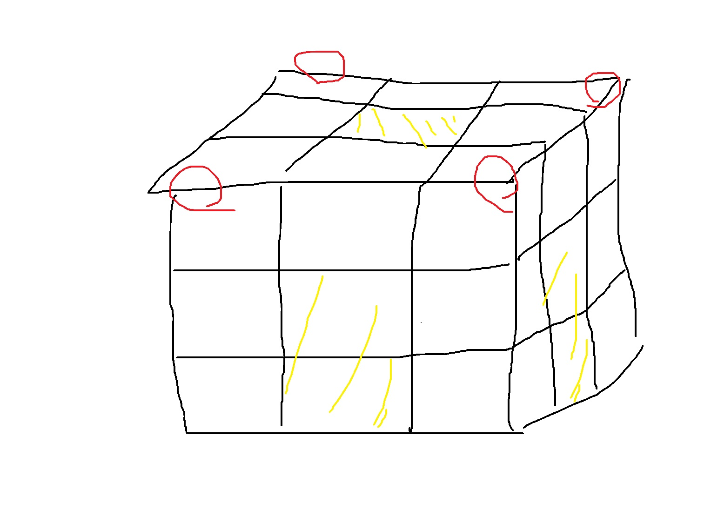

# [Gold V] 주사위 - 1041 

[문제 링크](https://www.acmicpc.net/problem/1041) 

### 성능 요약

메모리: 30840 KB, 시간: 68 ms

### 분류

그리디 알고리즘(greedy), 수학(math)


### 풀이





블록들은 각각 0에서 최대 3개의 면까지 사용된다.

3개의 면이 모두 사용되는 블록은 빨간색으로 표기한 4개의 블록 고정이다.

1개의 면이 사용되는 블록은 노란색으로 표기한 부분이며 `4*(N-1)*(N-2) + (N-2)**2` 개이다.

0개의 면이 사용되는 블록은 내부의 공간이며 `(N-1)*(N-2)*(N-2)`개이다.

2개의 면은 전체 블록에서 0,1,3면의 갯수를 뺀것과 같다.

따라서 주사위 6개의 면에서 인접한 3개의 면이 가장 작게 하면 된다.

그러나 A~F에서 최소값 3개를 고른다면 A,F처럼 마주보는 면이 같이 뽑히는 경우도 있기 때문에 이 부분을 고려해주어야한다.


```python
import sys

N=int(sys.stdin.readline())
A,B,C,D,E,F=map(int,sys.stdin.readline().split()) # 문제 입력

dict_num_ori={ 'A':A,'B':B,'C':C,'D':D,'E':E,'F':F} # 원본 딕셔너리

dict_num={ 'A':A,'B':B,'C':C,'D':D,'E':E,'F':F}

min_num=min(dict_num,key=dict_num.get) # 가장 작은 밸류를 가진 키값을 반환해준다.

max_num=max(dict_num_ori.values()) # N이 1일때를 위해 최대값을 찾아준다.


if min_num=='A' or min_num== 'F' :
    del dict_num['F']
    del dict_num['A']
    min_num2 = min(dict_num, key=dict_num.get)
    if min_num2 == 'B'or min_num2=='E':
        del dict_num['B']
        del dict_num['E']
        min_num3 = min(dict_num, key=dict_num.get)
    else:
        del dict_num['C']
        del dict_num['D']
        min_num3 = min(dict_num, key=dict_num.get)


elif min_num=='B'or min_num== 'E':
    del dict_num['E']
    del dict_num['B']
    min_num2 = min(dict_num, key=dict_num.get)
    if min_num2 == 'A' or min_num2=='F':
        del dict_num['A']
        del dict_num['F']
        min_num3 = min(dict_num, key=dict_num.get)
    else:
        del dict_num['C']
        del dict_num['D']
        min_num3 = min(dict_num, key=dict_num.get)

elif min_num=='C'or min_num=='D':
    del dict_num['D']
    del dict_num['C']
    min_num2 = min(dict_num, key=dict_num.get)
    if min_num2 == 'A' or min_num2=='F':
        del dict_num['A']
        del dict_num['F']
        min_num3 = min(dict_num, key=dict_num.get)
    else:
        del dict_num['B']
        del dict_num['E']
        min_num3 = min(dict_num, key=dict_num.get)

# 위 구간의 조건문은 마주보는 면을 제거하기 위한 조건문이다
        
real_num=dict_num_ori.get(min_num)
real_num2=dict_num_ori.get(min_num2)
real_num3=dict_num_ori.get(min_num3) # 가장 작은 3개의 값을 구해준다.


block_num=N**3 # 총 블록의 갯수
block1ea=4*(N-1)*(N-2) + (N-2)**2 # 면이 1개만 계산되는 블록의 갯수

block2ea = block_num - (block1ea + 4) - (N-1)*(N-2)*(N-2) # 면이 2개 계산되는 블록의 갯수

ans = 4 * (real_num+real_num2+real_num3) + (block2ea)*(real_num+real_num2) + (block1ea * real_num)
# 면이 3개인 블록은 항상 4개로 고정이다.


if N==1:
    print(A+B+C+D+E+F - max_num) #N이 1일때를 따로 구해준다.
else:
    print(ans)
```

